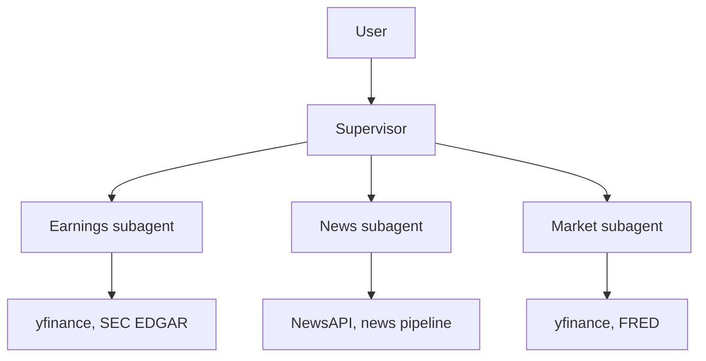
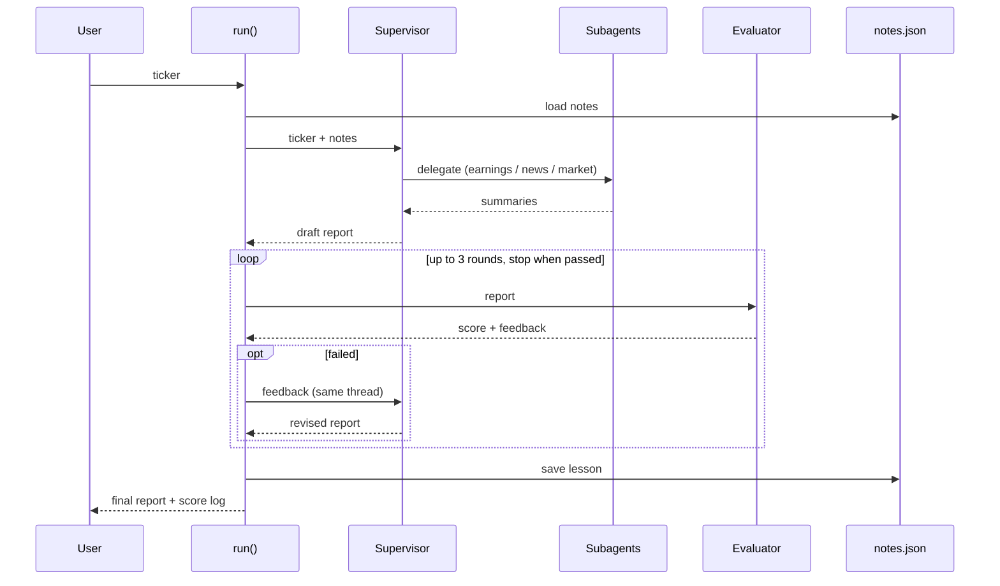

# multi-agent-financial-analyst

## Overview

A multi-agent investment research system that produces a report on a stock
ticker, built on LangChain's subagents (supervisor) pattern.

## Architecture



The order of one run is shown below. The evaluator is a single LLM call
made by `run()`, not an agent and not called by the supervisor.



- **Layer 1: Tools** (`agent/tools.py`): `@tool` functions that call external
  APIs.
- **Layer 2: Subagents** (`agent/subagents.py`): specialist agents, each
  wrapped as a tool.
- **Layer 3: Supervisor** (`agent/supervisor.py`): plans, routes to
  subagents, and synthesizes the report.

## Requirement map

Search for `# REQUIREMENT:` in `agent/` to find each one in the code.

| Requirement | File | How |
|---|---|---|
| Planning | `supervisor.py`, `prompts.py` | Supervisor prompt requires a numbered research plan before any tool call |
| Dynamic tool use | `tools.py`, `subagents.py` | Each subagent chooses among its own API tools |
| Self-reflection | `workflows.py`, `supervisor.py` | Evaluator scores the draft report |
| Learning across runs | `memory.py`, `supervisor.py` | Notes loaded at the start of `run()`, lesson saved at the end |
| Prompt chaining | `workflows.py` | Ingest → preprocess → classify → extract → summarize, exposed as a tool for the news subagent |
| Routing | `supervisor.py` | Supervisor chooses among the wrapped subagent tools |
| Evaluator–optimizer | `workflows.py`, `supervisor.py` | Generate → evaluate → refine loop in `run()`, max 3 rounds |

## Setup

Requires Python 3.11+.

```bash
python -m venv .venv
source .venv/bin/activate
pip install -r requirements.txt
cp .env.example .env  # then fill in your API keys
```

## How to run

TBD once `agent/supervisor.py` is implemented.

## Team and roles

| Name | Owns files |
|---|---|
| TBD | TBD |

## Course info

University of San Diego, Applied AI, Final Team Project.
