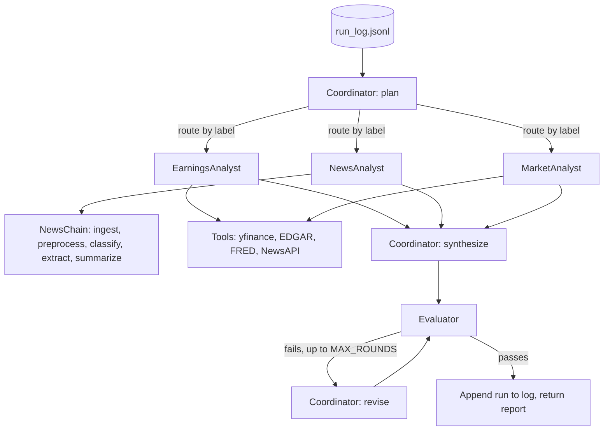

# multi-agent-financial-analyst

## Overview

A multi-agent Investment Research Agent that produces a report on a stock
ticker. It uses plain Python classes and the `openai` SDK, following the
course lab's `Agent` / `Coordinator` / team pattern. It does not use an agent
framework.

## Architecture



Agents pick tools by replying with JSON (`{"tool": ..., "args": ...}` or
`{"final": ...}`), so any chat model works for any agent.

## Project structure

```
.
├── code_notebook.ipynb    # Deliverable (exported to HTML)
├── agent/
│   ├── config.py          # Env, OpenAI client, default model, paths, eval settings
│   ├── prompts.py         # All prompts
│   ├── tools.py           # Data API functions + TOOLS registry
│   ├── memory.py          # Append-only run log
│   ├── base.py            # Agent base class (from the lab) + tool loop
│   ├── workflows.py       # NewsChain (prompt chaining), Evaluator
│   ├── specialists/       # earnings.py, news.py, market.py (one owner each)
│   ├── coordinator.py     # Plan, route, synthesize, revise
│   └── team.py            # InvestmentResearchTeam.run(ticker)
└── memory/run_log.jsonl
```

Find course requirements with `grep -rn "REQUIREMENT:" agent/`.

## Setup

```bash
python -m venv .venv && source .venv/bin/activate
pip install -r requirements.txt
cp .env.example .env  # fill in keys
```

## How to run

Open `code_notebook.ipynb` and run all cells. (The code is a scaffold and is not implemented yet.)

## Team and roles

| Name | Role | Owns |
|---|---|---|
| Sean McGowan | Foundation + orchestration | `config.py`, `base.py`, `memory.py`, `coordinator.py`, `team.py` |
| Ivan | Earnings + market | `specialists/earnings.py`, `specialists/market.py`, their tools (yfinance, EDGAR, FRED), `workflows.Evaluator` |
| Carlo | News + notebook | `specialists/news.py`, `workflows.NewsChain`, NewsAPI tool, notebook visualizations and HTML export |

Everyone writes the notebook cells and comments for the code they own.

## Course info

University of San Diego, Applied AI 520 Final Team Project.
