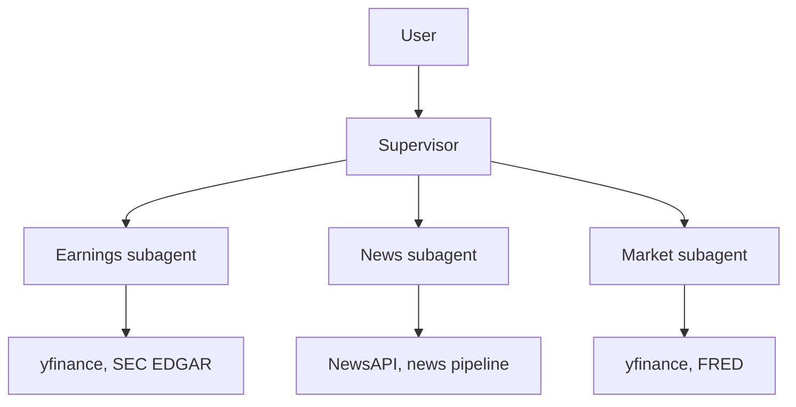
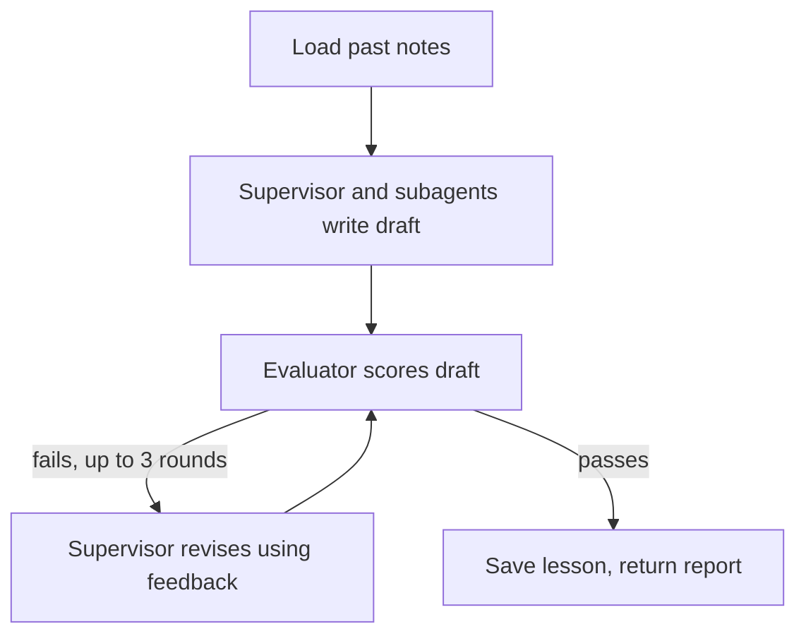

# multi-agent-financial-analyst

## Overview

A multi-agent investment research system that produces a report on a stock
ticker, built on LangChain's subagents (supervisor) pattern.

## Architecture



- **Layer 1: Tools** (`agent/tools.py`): `@tool` functions that call external
  APIs.
- **Layer 2: Subagents** (`agent/subagents.py`): specialist agents, each
  wrapped as a tool.
- **Layer 3: Supervisor** (`agent/supervisor.py`): plans, routes to
  subagents, and synthesizes the report.

Each run then goes through a review loop. The evaluator is a single LLM
call, not an agent.



## Project structure

```
.
├── README.md
├── requirements.txt       # Pinned dependencies
├── .env.example           # API keys to copy into .env
├── notebook.ipynb         # Final report notebook
├── agent/
│   ├── __init__.py        # Package overview and import order
│   ├── config.py          # Env vars, shared model, paths, eval settings
│   ├── prompts.py         # All system prompts
│   ├── tools.py           # Layer 1: API tools (yfinance, NewsAPI, FRED, EDGAR)
│   ├── memory.py          # Notes saved across runs
│   ├── workflows.py       # News prompt chain and report evaluator
│   ├── subagents.py       # Layer 2: earnings, news, market agents
│   └── supervisor.py      # Layer 3: supervisor and run() entry point
└── memory/
    └── notes.json         # Stored lessons from past runs
```

Course requirements are tagged in the code with `# REQUIREMENT:`. Find them
with `grep -rn "REQUIREMENT:" agent/`.

## Setup

Requires Python 3.11+.

```bash
python -m venv .venv
source .venv/bin/activate
pip install -r requirements.txt
cp .env.example .env  # then fill in your API keys
```

## How to run

TBD once `agent/supervisor.py` is implemented.

## Team and roles

| Name | Owns files |
|---|---|
| TBD | TBD |

## Course info

University of San Diego, Applied AI, Final Team Project.
